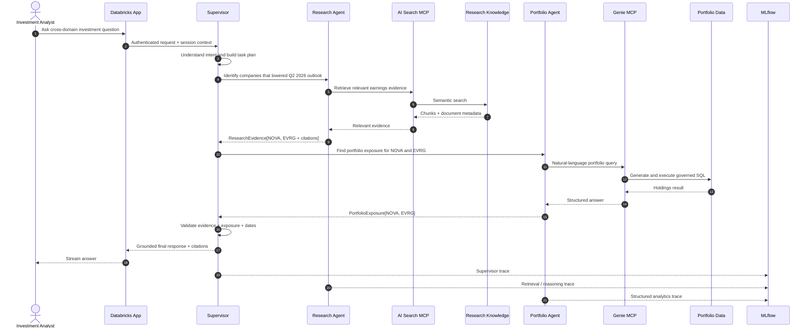

# Blue Harbor Investment Research Agent

> **A production-style Agentic AI learning POC on Databricks that combines unstructured investment research with structured portfolio data through specialist agents, governed MCP tools, and a supervisor-led orchestration layer.**

<p align="left">
  
  
  
  
  
  
</p>

---

## What this project is

**Blue Harbor Investment Research Agent** is an end-to-end learning project for designing, building, evaluating, securing, and deploying a modern enterprise Agentic AI system on Databricks.

The project is intentionally built around a business question that **cannot be answered from one data source or one simple RAG call**:

> ### Which companies lowered their outlook this quarter, and how much do we own of them?

To answer correctly, the system must:

1. Understand the analyst's intent.
2. Search unstructured earnings reports, earnings-call transcripts, and analyst notes.
3. Determine which companies actually lowered forward guidance.
4. Preserve supporting evidence and citations.
5. Pass the identified companies to a structured-data specialist.
6. Query portfolio holdings across funds.
7. Aggregate exposure correctly as of a defined date.
8. Synthesize research evidence and portfolio exposure into one grounded answer.
9. Record the full execution trace for evaluation and debugging.
10. Apply governance, authorization, reliability limits, and guardrails throughout the run.

This is therefore not a **"chat with PDFs"** demo. It is a controlled multi-agent system that demonstrates **cross-domain reasoning over enterprise data**.

---

# Target Architecture

The target architecture follows a **manager-style multi-agent pattern**:

- one **Supervisor / Coordinator** remains responsible for the user conversation and final answer,
- specialist agents perform bounded domain work,
- MCP provides governed access to tools and data,
- deterministic operations remain deterministic tools rather than unnecessary agents,
- state, governance, observability, evaluation, and delivery are treated as first-class architectural layers.

Databricks' current multi-agent guidance explicitly supports orchestrating a RAG-oriented specialist together with a Genie-oriented structured-data specialist from a single entry point. The current Databricks custom-agent template also uses the **OpenAI Agents SDK**, **MLflow `ResponsesAgent`**, **MLflow AgentServer**, Databricks Apps, and MCP-based tools as its recommended application architecture.

## Architecture at a glance

```mermaid
flowchart TB

    %% ==========================================================
    %% EXPERIENCE
    %% ==========================================================
    subgraph EXP["1. EXPERIENCE & TRUST BOUNDARY"]
        USER["Investment Analyst"]
        APP["Databricks App<br/>Chat UI"]
        AUTH["Authentication / Identity<br/>OAuth or On-Behalf-of-User"]
        IG["Input Guardrails<br/>Policy + Prompt-Injection Checks"]

        USER --> APP --> AUTH --> IG
    end

    %% ==========================================================
    %% APPLICATION RUNTIME
    %% ==========================================================
    subgraph RUNTIME["2. AGENT APPLICATION RUNTIME"]
        SERVER["MLflow AgentServer<br/>Responses API / Streaming"]
        RESP["MLflow ResponsesAgent<br/>Framework Compatibility Layer"]
        SUP["Supervisor / Coordinator<br/>OpenAI Agents SDK Manager"]

        SERVER --> RESP --> SUP
    end

    IG --> SERVER

    %% ==========================================================
    %% SUPERVISOR RESPONSIBILITIES
    %% ==========================================================
    subgraph CTRL["3. ORCHESTRATION & CONTROL"]
        INTENT["Intent + Task Planning"]
        ROUTE["Dynamic Routing + Delegation"]
        CTX["Context Builder<br/>Minimum Necessary Context"]
        REL["Execution Policy<br/>Timeout · Retry · Max Turns · Fallback"]
        SYN["Validation + Final Synthesis<br/>Evidence · Exposure · Citations"]
    end

    SUP --> INTENT --> ROUTE
    SUP --> CTX
    REL -. constrains .-> SUP
    SUP --> SYN

    %% ==========================================================
    %% SPECIALIST AGENTS
    %% ==========================================================
    subgraph AGENTS["4. DOMAIN SPECIALIST AGENTS"]
        RA["Research Agent<br/><br/>Earnings specialist<br/>Guidance classification<br/>Evidence extraction"]
        PA["Portfolio Agent<br/><br/>Holdings specialist<br/>Exposure / fund analytics"]
        FUTURE["Future Specialist<br/>Risk / Market Data<br/>Only when justified"]
    end

    ROUTE -->|"research task"| RA
    ROUTE -->|"portfolio task"| PA
    ROUTE -.->|"future"| FUTURE

    %% ==========================================================
    %% STRUCTURED CONTRACTS
    %% ==========================================================
    subgraph CONTRACTS["5. TYPED AGENT CONTRACTS"]
        RE["ResearchEvidence<br/>ticker · status · old/new guide<br/>reason · source refs · confidence"]
        PE["PortfolioExposure<br/>ticker · fund · value · weight<br/>as-of date"]
        FA["FinalAnswer<br/>claims · exposures · citations<br/>limitations"]
    end

    RA --> RE --> SYN
    PA --> PE --> SYN
    SYN --> FA --> SERVER

    %% ==========================================================
    %% MCP / TOOL PLANE
    %% ==========================================================
    subgraph TOOLS["6. GOVERNED MCP & TOOL PLANE"]
        AISMCP["AI Search MCP"]
        GENIEMCP["Genie MCP"]
        UCF["Unity Catalog Functions<br/>Deterministic calculations"]
        EXT["Future Approved MCP<br/>Market / enterprise services"]
    end

    RA --> AISMCP
    PA --> GENIEMCP
    SUP --> UCF
    FUTURE -.-> EXT

    %% ==========================================================
    %% DATA / KNOWLEDGE
    %% ==========================================================
    subgraph DATA["7. KNOWLEDGE & DATA PLANE"]
        RAW["UC Volume<br/>Raw Research Documents"]
        META["Document Manifest<br/>Metadata"]
        CHUNKS["Delta Table<br/>Parsed + Chunked Research"]
        INDEX["Databricks AI Search Index"]
        TABLES["Unity Catalog Delta Tables<br/>Holdings · Funds · Companies"]
        GENIE["Genie Agent / Space<br/>Curated Structured Analytics"]
    end

    RAW --> CHUNKS
    META --> CHUNKS
    CHUNKS --> INDEX
    AISMCP --> INDEX

    TABLES --> GENIE
    GENIEMCP --> GENIE

    %% ==========================================================
    %% STATE / MEMORY
    %% ==========================================================
    subgraph STATE["8. STATE & MEMORY"]
        SESSION["Short-Term Session State<br/>Multi-turn context"]
        MEMORY["Optional Durable Memory<br/>Managed Agent Memory / Lakebase"]
    end

    SESSION <--> SUP
    MEMORY -. scoped context .-> CTX

    %% ==========================================================
    %% SECURITY / GOVERNANCE
    %% ==========================================================
    subgraph GOV["9. SECURITY & GOVERNANCE — CROSS-CUTTING"]
        UC["Unity Catalog<br/>Data · Functions · Permissions · Lineage"]
        AIG["Unity AI Gateway<br/>AI / MCP Control Plane"]
        POLICY["Service Policies<br/>Tool exposure · rate · budget · content controls"]
        IDENT["Least Privilege Identity<br/>App authorization / OBO"]
    end

    UC -. governs .-> RAW
    UC -. governs .-> TABLES
    UC -. governs .-> UCF
    UC -. governs .-> AISMCP
    UC -. governs .-> GENIEMCP

    AIG -. governs runtime access .-> AISMCP
    AIG -. governs runtime access .-> GENIEMCP
    AIG -. governs runtime access .-> EXT
    POLICY -. applied through .-> AIG
    IDENT -. propagated to .-> AIG

    %% ==========================================================
    %% OBSERVABILITY / EVALUATION
    %% ==========================================================
    subgraph OBS["10. OBSERVABILITY, EVALUATION & IMPROVEMENT"]
        TRACE["MLflow Tracing<br/>Agent · tool · retrieval · latency · tokens"]
        EVAL["MLflow GenAI Evaluation<br/>Routing · correctness · groundedness"]
        GOLD["Evaluation Dataset<br/>Golden questions + expectations"]
        FB["Human Feedback<br/>Analyst review"]
        PROMPT["Prompt / Agent Versioning"]
        MON["Production Monitoring<br/>Quality · latency · errors · cost"]
    end

    SUP -. traced .-> TRACE
    RA -. traced .-> TRACE
    PA -. traced .-> TRACE
    AISMCP -. traced .-> TRACE
    GENIEMCP -. traced .-> TRACE

    TRACE --> EVAL
    GOLD --> EVAL
    FB --> GOLD
    EVAL --> PROMPT
    TRACE --> MON

    %% ==========================================================
    %% ENGINEERING / DELIVERY
    %% ==========================================================
    subgraph DELIVERY["11. ENGINEERING & DELIVERY"]
        GH["GitHub"]
        CI["CI/CD<br/>Unit · Integration · Evaluation Gates"]
        BUNDLE["Databricks Deployment Configuration"]
        DEPLOY["Databricks Apps"]
        CONFIG["Environment Configuration<br/>Secrets / Resource References"]
    end

    GH --> CI --> BUNDLE --> DEPLOY
    CONFIG --> DEPLOY
    DEPLOY --> APP
```



---

## How to read the architecture

The main request path is intentionally hierarchical:

```text
Investment Analyst
        ↓
Databricks App
        ↓
AgentServer / Responses API
        ↓
ResponsesAgent
        ↓
Supervisor / Coordinator
        ↓
   ┌────┴─────┐
   ↓          ↓
Research   Portfolio
 Agent       Agent
   ↓          ↓
AI Search   Genie
   MCP        MCP
   ↓          ↓
Research    Holdings
Knowledge   Data
   └────┬─────┘
        ↓
Supervisor synthesis
        ↓
Grounded response + citations
```

The layers surrounding that path provide the controls required to make the system **observable, governed, testable, and production-oriented**.

---

# Why a Supervisor / Coordinator?

There are two common multi-agent orchestration styles:

| Pattern | Behavior | Best fit |
|---|---|---|
| **Manager / agents-as-tools** | One manager remains in control and invokes specialists for bounded tasks | One final answer must combine multiple domains |
| **Handoff** | Control of the conversation transfers to a specialist | The selected specialist should directly own the rest of the interaction |

Blue Harbor uses the **manager pattern**.

The Research Agent and Portfolio Agent should not compete to answer the user independently. The Supervisor owns the question, delegates domain-specific work, validates returned contracts, and produces the final answer.

That gives us:

```text
one user experience
        +
multiple specialist reasoning domains
        +
centralized synthesis and control
```

---

# Flagship Runtime Flow

For the primary business question:

> **Which companies lowered their outlook this quarter, and how much do we own of them?**

the workflow is **dependency-aware**, not blindly parallel.



### Why sequential here?

The Portfolio Agent cannot correctly answer the second part until the Research Agent identifies the companies.

```text
Research
   ↓
NOVA + EVRG
   ↓
Portfolio lookup
```

Independent work can be parallelized later, but **dependency-aware orchestration is the default**.

---

# Specialist Agent Boundaries

## Research Agent

### Owns

- earnings reports,
- earnings-call transcripts,
- analyst notes,
- forward-guidance interpretation,
- raised / maintained / lowered classification,
- prior-vs-current guidance comparison,
- management rationale,
- supporting evidence,
- document citations.

### Does not own

- holdings aggregation,
- arbitrary portfolio SQL,
- access-control policy,
- final cross-domain response.

### Expected contract

```json
{
  "ticker": "NOVA",
  "company_name": "NovaChip Technologies",
  "guidance_status": "LOWERED",
  "metric": "FY2026 revenue",
  "previous_guidance": "$5.4B-$5.6B",
  "current_guidance": "$5.0B-$5.2B",
  "reason": [
    "export-license delays",
    "hyperscale customer deployment shift"
  ],
  "citations": [
    {
      "document_id": "NOVA_Q2_2026_earnings_call",
      "chunk_id": "..."
    }
  ],
  "confidence": 0.97
}
```

---

## Portfolio Agent

### Owns

- holdings,
- funds,
- position aggregation,
- market-value exposure,
- portfolio weight,
- as-of-date logic,
- structured-data questions through Genie.

### Does not own

- earnings interpretation,
- RAG retrieval,
- research citations,
- final cross-domain answer.

### Expected contract

```json
{
  "ticker": "NOVA",
  "as_of_date": "2026-06-30",
  "total_market_value_usd": 220000000,
  "positions": [
    {
      "fund": "Blue Harbor Growth Fund",
      "market_value_usd": 120000000
    },
    {
      "fund": "Blue Harbor Core Equity Fund",
      "market_value_usd": 70000000
    },
    {
      "fund": "Blue Harbor Sustainable Opportunities Fund",
      "market_value_usd": 30000000
    }
  ]
}
```

---

# Why Typed Contracts Matter

Specialist agents should not return unrestricted paragraphs when the Supervisor needs a predictable payload.

Typed contracts give us:

- clear agent boundaries,
- lower token/context usage,
- schema validation,
- easier unit testing,
- easier trace evaluation,
- safer inter-agent communication,
- simpler failure handling,
- less accidental data leakage,
- more deterministic orchestration.

The Supervisor can still convert structured specialist outputs into a natural-language final answer.

---

# Governed Tool Architecture: MCP

**Model Context Protocol (MCP)** is the standard tool-access layer in the target architecture.

```text
Research Agent
    └── MCP → Databricks AI Search

Portfolio Agent
    └── MCP → Genie

Supervisor
    └── tool → Unity Catalog Function

Future specialist
    └── MCP → approved external service
```

Databricks currently provides managed MCP servers for capabilities including:

- **AI Search**
- **Genie**
- **Databricks SQL**
- **Unity Catalog functions**

Managed MCP services are centrally visible and governed through Unity AI Gateway, while Unity Catalog permissions continue to constrain the underlying data and functions.

---

# MCP vs A2A

MCP and agent-to-agent communication solve different problems.

| Concern | MCP | A2A-style agent protocol |
|---|---|---|
| Primary purpose | Agent → tools / data / capabilities | Agent → independently deployed agent |
| Blue Harbor v1 | **Yes** | **No** |
| Why | AI Search, Genie and functions are tools | Our specialists live inside one solution boundary |

We intentionally **do not add A2A simply because it is fashionable**.

A2A becomes more relevant if a future architecture looks like:

```text
Blue Harbor Supervisor
        │
        └── external agent protocol
                ↓
        Enterprise Risk Agent
        owned by another platform/team
```

Until that need exists, MCP + in-process/app-level specialist orchestration is simpler and more appropriate.

---

# Knowledge & Data Architecture

The system has two deliberately different knowledge paths.

## Unstructured research path

```text
Synthetic research documents
        ↓
Unity Catalog Volume
        ↓
Parse / normalize
        ↓
Chunk
        ↓
Delta document-chunk table
        ↓
Embeddings
        ↓
Databricks AI Search index
        ↓
AI Search MCP
        ↓
Research Agent
```

Research sources include:

- earnings reports,
- earnings-call transcripts,
- analyst notes.

The retrieval contract must preserve metadata required for trustworthy citation:

```text
document id
company / ticker
quarter
document type
published date
chunk id
source path
retrieved text
```

---

## Structured portfolio path

```text
Synthetic seed CSV
        ↓
Unity Catalog Volume
        ↓
Delta tables
        ↓
Unity Catalog
        ↓
Curated Genie Agent / Space
        ↓
Genie MCP
        ↓
Portfolio Agent
```

Structured data includes:

- companies,
- funds,
- holdings,
- as-of dates,
- position values,
- portfolio weights.

---

# Unity Catalog Target Layout

```text
blue_harbor
│
├── research
│   ├── raw_documents              # UC Volume
│   ├── document_manifest          # Delta
│   ├── document_chunks            # Delta
│   └── <ai_search_index>          # AI Search
│
├── portfolio
│   ├── seed_data                  # UC Volume
│   ├── companies                  # Delta
│   ├── funds                      # Delta
│   └── holdings                   # Delta
│
└── agent
    ├── evaluation_data            # later
    ├── functions                  # deterministic UC tools
    └── operational_assets         # later as needed
```

Unity Catalog is part of the agent design—not merely where tables happen to live.

---

# State vs Memory

These are intentionally separate architectural concepts.

## Short-term session state — required

Example:

```text
User:
Which companies lowered guidance?

Agent:
NovaChip and Evergreen.

User:
Which fund owns the most of them?
```

The second turn must resolve **"them"** to the companies identified in the previous turn.

That is conversation/session state.

## Durable memory — optional later

Long-term memory would allow context to survive across sessions.

Target options to explore later:

- Databricks Managed Agent Memory
- Lakebase-backed state / memory

We do **not** add durable memory until the business use case requires it.

---

# Security & Governance

The target architecture applies security at multiple enforcement points.

```text
User
 │
 ├─ 1. Authentication / identity
 ▼
Input
 │
 ├─ 2. Input policy / prompt-injection guardrail
 ▼
Supervisor
 │
 ├─ 3. Allowed specialist set + execution policy
 ▼
Specialist Agent
 │
 ├─ 4. Tool allow-list + typed arguments
 ▼
Unity AI Gateway / MCP
 │
 ├─ 5. Tool exposure + runtime controls
 ▼
Unity Catalog
 │
 ├─ 6. Table / function / data permissions
 ▼
Tool Result
 │
 ├─ 7. Treat retrieved content as untrusted data
 ▼
Supervisor
 │
 ├─ 8. Output validation / evidence checks
 ▼
User
```

### Security scenarios we intend to test

- direct prompt injection,
- indirect prompt injection embedded in earnings documents,
- unauthorized tool invocation,
- attempts to query data outside the allowed scope,
- malicious or malformed tool arguments,
- attempts to make retrieved text behave like system instructions,
- excessive tool / agent loops,
- unsupported claims without evidence.

**Retrieved documents are data, never instructions.**

---

# What Is Intentionally Not an Agent?

A modern agent system should not turn every function into another LLM.

| Capability | Implementation | Why |
|---|---|---|
| Exposure arithmetic | UC / Python function | Deterministic |
| Authentication | Databricks / OAuth | Security control |
| Authorization | Unity Catalog / AI Gateway | Policy |
| Timeouts / retries | Runtime code | Deterministic control |
| Prompt-injection policy | Guardrail | Security |
| Logging / traces | MLflow | Observability |
| Quality scoring | MLflow Evaluation | Evaluation |
| Ingestion / chunking | Data pipeline | Data engineering |
| Schema validation | Pydantic / typed code | Deterministic |
| CI/CD | GitHub / Databricks workflow | Engineering |

The goal is:

> **LLM autonomy where judgment adds value + deterministic controls where predictability matters.**

---

# Reliability & Failure Handling

Agentic systems fail differently from normal request/response applications, so the Supervisor owns an explicit execution budget.

Target controls include:

```text
max supervisor turns
max specialist invocations
max tool calls
tool timeout
limited retry with backoff
schema validation
loop detection
fallback behavior
partial-result handling
clarifying-question behavior
```

Example:

```text
AI Search call
     │
     ├── success → continue
     │
     └── failure
           ↓
      bounded retry
           ↓
      still failing?
           ↓
      controlled fallback
           ↓
      report limitation
```

Unlimited autonomous loops are **not** a production design.

---

# Observability: Trace the Reasoning System

MLflow Tracing should expose the full execution tree:

```text
User Request
  │
  └── Supervisor
        │
        ├── Research Agent
        │      └── AI Search MCP
        │              └── retrieval
        │
        ├── Portfolio Agent
        │      └── Genie MCP
        │              └── structured query
        │
        └── Final synthesis
```

For each run we want visibility into:

- which agent ran,
- why it was selected,
- which tool was called,
- tool arguments,
- retrieved evidence,
- structured outputs,
- failures and retries,
- model/token usage,
- latency,
- final response,
- evaluation scores.

---

# Evaluation Strategy

A polished final sentence can still come from a broken reasoning path.

Therefore Blue Harbor evaluates **intermediate behavior and final quality**.

| Layer | What we evaluate |
|---|---|
| Intent | Did the system understand the business question? |
| Supervisor | Was the task decomposed correctly? |
| Routing | Was the correct specialist selected? |
| Research retrieval | Were the right chunks/documents retrieved? |
| Research reasoning | Was guidance correctly classified? |
| Evidence | Does the citation actually support the claim? |
| Portfolio routing | Was structured analytics invoked when needed? |
| Genie / tool call | Were tickers, dates, filters and semantics correct? |
| Structured result | Was exposure aggregated correctly? |
| Synthesis | Were research + holdings combined correctly? |
| Groundedness | Are material claims supported? |
| Multi-turn state | Were follow-up references resolved correctly? |
| Security | Were injection / unauthorized-tool attempts blocked? |
| Reliability | Were retries, timeouts and loops handled correctly? |
| Operations | Latency, tokens, tool calls, errors, cost |

---

# Evaluation Dataset

The repository includes a controlled ground-truth dataset.

Example flagship expectation:

```text
Research result:
NOVA → guidance lowered
EVRG → guidance lowered

Portfolio result:
NOVA → $220M
EVRG → $85M

Combined exposure:
$305M
```

The file:

```text
evals/GROUND_TRUTH_DO_NOT_INDEX.md
```

must **never** be added to the RAG corpus or AI Search index.

It exists only for evaluation.

---

# Human Feedback & Improvement Loop

The target production feedback loop is:

```text
Production interaction
        ↓
MLflow trace
        ↓
Analyst feedback
        ↓
Evaluation dataset
        ↓
Regression test
        ↓
Prompt / retrieval / tool improvement
        ↓
New version
        ↓
Evaluation gate
        ↓
Redeploy
```

The project therefore treats evaluation as part of the application lifecycle, not a one-time notebook exercise.

---

# Prompt & Agent Versioning

Early implementation may keep prompts in source files so the mechanics remain visible.

As the system matures, prompts and agent behavior should become versioned assets so that changes can be evaluated before promotion.

Examples of things that should ultimately be versioned:

```text
Research Agent instructions
Portfolio Agent instructions
Supervisor instructions
retrieval configuration
model choice
tool descriptions
typed output schemas
evaluation dataset
scorer configuration
```

---

# Databricks Runtime Architecture

The current target application runtime is:

```text
Databricks Apps
      ↓
MLflow AgentServer
      ↓
Responses API
      ↓
MLflow ResponsesAgent
      ↓
OpenAI Agents SDK
      ↓
Supervisor / Specialist Agents
      ↓
Managed MCP tools
```

Why this matters:

- **Databricks Apps** provides the user-facing deployment surface.
- **MLflow AgentServer** provides the application server / agent request path.
- **ResponsesAgent** provides a framework-neutral compatibility layer for Databricks tracing, evaluation, Playground, and deployment.
- **OpenAI Agents SDK** provides our agent definitions and orchestration primitives.
- **MCP** provides the governed tool interface.

This gives us a modern application architecture while still allowing us to learn the orchestration logic ourselves.

---

# Custom Supervisor First, Managed Supervisor Later

The learning strategy intentionally has two stages.

## Stage 1 — Build the manager ourselves

Using the OpenAI Agents SDK, we expose the mechanics:

```text
intent
  ↓
plan
  ↓
select specialist
  ↓
invoke agent/tool
  ↓
validate contract
  ↓
invoke dependent specialist
  ↓
synthesize
```

This teaches:

- agents-as-tools,
- routing,
- tool calling,
- dependency handling,
- state,
- structured outputs,
- failure handling,
- trace interpretation.

## Stage 2 — Compare with Databricks Supervisor Agent

After we understand the mechanics, we can compare the custom implementation with Databricks' managed **Supervisor Agent** capability where available.

That gives us both:

> **understanding of orchestration internals**

and

> **understanding of the managed Databricks multi-agent experience**

---

# Synthetic Business Dataset

All companies, funds, research reports, holdings, values, and scenarios are fictional.

## Companies

| Ticker | Company | Sector | Designed Q2 2026 outcome |
|---|---|---|---|
| `NOVA` | NovaChip Technologies | Semiconductors | Lowered outlook |
| `EVRG` | Evergreen Energy Systems | Renewable Energy | Lowered outlook |
| `APXR` | Apex Retail Group | Consumer Retail | Maintained outlook |
| `MDHN` | Meridian Health Systems | Healthcare Services | Raised outlook |
| `VTXI` | Vertex Industrial Technologies | Industrials | Maintained outlook |

Each company has:

- an earnings report,
- an earnings-call transcript,
- an analyst note.

## Funds

The sample portfolio contains:

- Blue Harbor Growth Fund
- Blue Harbor Core Equity Fund
- Blue Harbor Sustainable Opportunities Fund

The data is intentionally distributed across funds so exposure must be aggregated rather than retrieved as a precomputed answer.

---

# Example Questions

### Research only

```text
Did Apex Retail lower its full-year outlook?
Show the supporting evidence.
```

### Structured data only

```text
What is Blue Harbor's total position in NovaChip?
```

### Cross-domain

```text
Which companies lowered their outlook this quarter,
and how much do we own of them?
```

### Cross-domain + reasoning

```text
Summarize the companies that reduced guidance,
explain management's rationale,
and rank them by Blue Harbor exposure.
```

### Multi-turn

```text
User:
Which companies lowered guidance?

Agent:
NovaChip and Evergreen.

User:
Which fund has the largest exposure to them?
```

---

# Repository Structure

```text
blue-harbor-investment-agent/
│
├── README.md
│
├── pyproject.toml                       # later
├── databricks.yml                       # later deployment configuration
│
├── config/
│   └── ...
│
├── data/
│   ├── documents/
│   │   ├── NOVA_Q2_2026_earnings_report.md
│   │   ├── NOVA_Q2_2026_earnings_call.md
│   │   ├── NOVA_Q2_2026_analyst_note.md
│   │   └── ...
│   │
│   └── seed/
│       ├── companies.csv
│       ├── funds.csv
│       ├── holdings.csv
│       └── documents_manifest.csv
│
├── notebooks/
│   ├── 00_environment_check.py
│   ├── 01_setup_unity_catalog.py
│   ├── 02_load_sample_data.py
│   ├── 03_ingest_documents.py
│   ├── 04_prepare_document_chunks.py
│   ├── 05_build_ai_search.py
│   ├── 06_test_retrieval.py
│   ├── 07_build_research_agent.py
│   ├── 08_build_portfolio_agent.py
│   ├── 09_build_supervisor.py
│   └── 10_evaluate_system.py
│
├── src/
│   └── blue_harbor_agent/
│       ├── __init__.py
│       │
│       ├── agents/
│       │   ├── research_agent.py
│       │   ├── portfolio_agent.py
│       │   └── supervisor_agent.py
│       │
│       ├── contracts/
│       │   ├── research.py
│       │   ├── portfolio.py
│       │   └── responses.py
│       │
│       ├── rag/
│       │   ├── parsing.py
│       │   ├── chunking.py
│       │   └── retrieval.py
│       │
│       ├── tools/
│       │   ├── research_tools.py
│       │   ├── portfolio_tools.py
│       │   └── calculation_tools.py
│       │
│       ├── prompts/
│       │   ├── supervisor.py
│       │   ├── research.py
│       │   └── portfolio.py
│       │
│       ├── guardrails/
│       │   └── ...
│       │
│       ├── state/
│       │   └── ...
│       │
│       └── utils/
│           └── ...
│
├── evals/
│   ├── evaluation_questions.jsonl
│   ├── GROUND_TRUTH_DO_NOT_INDEX.md
│   └── scorers/
│       └── ...
│
├── tests/
│   ├── unit/
│   ├── integration/
│   ├── security/
│   └── regression/
│
├── setup/
│   └── 01_create_catalog.sql
│
├── docs/
│   ├── business_problem.md
│   ├── decisions/
│   └── diagrams/
│
└── app/
    └── ...
```

The repository grows incrementally. The target structure shows where the project is going; not every file is expected to exist on day one.

---

# Implementation Roadmap

| Phase | Capability | Key outcome |
|---|---|---|
| **0** | Environment validation | Confirm Free Edition / workspace capabilities |
| **1** | Data foundation | Unity Catalog, volumes, Delta tables |
| **2** | RAG foundation | Parse, chunk, embed, AI Search |
| **3** | Research Agent | Guidance reasoning + citations |
| **4** | Structured analytics | Genie configuration + structured query tests |
| **5** | Portfolio Agent | Exposure reasoning through governed tools |
| **6** | Supervisor | Multi-agent manager orchestration |
| **7** | MCP | Managed AI Search / Genie tool integration |
| **8** | State | Multi-turn conversational behavior |
| **9** | Reliability | Retries, timeouts, fallback, loop limits |
| **10** | Security | Prompt injection, permissions, tool boundaries |
| **11** | Evaluation | RAG, routing, tools, groundedness, multi-turn |
| **12** | Feedback | Analyst feedback → evaluation data |
| **13** | Production app | AgentServer + ResponsesAgent + Databricks Apps |
| **14** | CI/CD | Automated tests + evaluation gates + deployment |
| **15** | Production monitoring | Quality, latency, errors, token/cost trends |
| **16** | Advanced extensions | Durable memory / external MCP / new specialists |

---

# Current Implementation Status

> **Status: Active learning POC — early implementation**

| Component | Status |
|---|---|
| Synthetic research documents | ✅ Ready |
| Synthetic portfolio data | ✅ Ready |
| Evaluation ground truth | ✅ Ready |
| GitHub project structure | ✅ In progress |
| Environment check | ⏳ Next |
| Unity Catalog data foundation | ⏳ |
| Document ingestion / chunking | ⏳ |
| AI Search | ⏳ |
| Research Agent | ⏳ |
| Genie structured analytics | ⏳ |
| Portfolio Agent | ⏳ |
| Supervisor | ⏳ |
| MCP integration | ⏳ |
| State / memory | ⏳ |
| Security tests | ⏳ |
| MLflow evaluation | ⏳ |
| Databricks App | ⏳ |
| CI/CD | ⏳ |

---

# Technology Mapping

| Architecture capability | Target technology |
|---|---|
| End-user experience | Databricks Apps |
| Agent HTTP runtime | MLflow AgentServer |
| Agent interface | MLflow `ResponsesAgent` |
| Agent framework | OpenAI Agents SDK |
| Supervisor | Custom manager first; managed Supervisor comparison later |
| Research specialist | Custom OpenAI Agents SDK agent |
| Portfolio specialist | Custom agent + Genie |
| Unstructured retrieval | Databricks AI Search |
| Tool protocol | MCP |
| Structured analytics | Genie / Genie MCP |
| Deterministic functions | Unity Catalog Functions / Python |
| Structured storage | Delta Lake |
| Raw documents | Unity Catalog Volumes |
| Data governance | Unity Catalog |
| Runtime AI governance | Unity AI Gateway |
| Short-term state | Agent session / thread state |
| Durable memory | Managed Agent Memory or Lakebase later |
| Tracing | MLflow Tracing |
| Evaluation | MLflow 3 GenAI Evaluation |
| Human feedback | MLflow feedback / evaluation datasets |
| Source control | GitHub + Databricks Git folders |
| Deployment configuration | Databricks deployment tooling |
| CI/CD | GitHub Actions + Databricks deployment workflow |

---

# Engineering Principles

1. **Start with the simplest architecture that solves the problem.**
2. **Add autonomy only where reasoning adds value.**
3. **Do not use an agent where deterministic code is better.**
4. **Keep the Supervisor responsible for one coherent user experience.**
5. **Give specialist agents narrow domain responsibilities.**
6. **Prefer typed contracts over prose between components.**
7. **Pass the minimum context required for each task.**
8. **Treat retrieved documents as untrusted content.**
9. **Use least-privilege data and tool access.**
10. **Bound autonomous loops with explicit execution limits.**
11. **Trace every meaningful agent and tool decision.**
12. **Evaluate intermediate behavior, not just the final answer.**
13. **Keep evaluation ground truth separate from runtime knowledge.**
14. **Make quality gates part of CI/CD.**
15. **Treat cost, latency and reliability as design constraints.**
16. **A notebook working once is not production readiness.**

---

# Free Edition / Workspace Compatibility

This repository is being built as a learning POC and can begin in a Databricks Free Edition workspace.

However, the **target architecture intentionally includes capabilities that may be Preview, Beta, quota-limited, region-dependent, or unavailable in a particular Free Edition workspace**.

Examples currently include managed MCP capabilities and some Genie / agent features.

For that reason, the first implementation step is an explicit environment-capability check.

Where a managed target capability is unavailable, the learning plan can use a temporary fallback while keeping the **target architecture unchanged**.

Example:

```text
Target:
Portfolio Agent → Genie MCP

Temporary learning fallback if unavailable:
Portfolio Agent → typed UC / SQL function
```

The fallback teaches the same orchestration boundary without pretending the workspace supports a feature that it does not.

---

# Getting Started

## 1. Clone the repository

```bash
git clone <your-repository-url>
cd blue-harbor-investment-agent
```

## 2. Connect the repository to Databricks

Clone it into a **Databricks Git folder** so GitHub remains the source of truth for the project code.

## 3. Run the environment check

The first implementation artifact is:

```text
notebooks/00_environment_check.py
```

It will verify:

```text
identity
catalog access
schema / volume capability
serverless execution
Python/runtime environment
model access
AI Search availability
Genie availability
managed MCP availability
MLflow capabilities
Databricks Apps availability
```

## 4. Build the data foundation

Only after the environment is understood do we create the Unity Catalog objects and upload the synthetic source data.

---

# Reference Architecture Sources

The target design is intentionally aligned with current official platform guidance:

### Databricks

- [Get started with agents](https://docs.databricks.com/aws/en/agents/tutorials/agent-quickstart)
- [Author an agent and deploy it on Databricks Apps](https://docs.databricks.com/aws/en/agents/custom-agents/author-agent)
- [Build a multi-agent system on Databricks Apps](https://docs.databricks.com/aws/en/agents/custom-agents/multi-agent-apps)
- [MCPs and agent tools](https://docs.databricks.com/aws/en/agents/agent-framework/agent-tool)
- [AI Search MCP](https://docs.databricks.com/aws/en/agents/mcp-tools/ai-search)
- [Genie Agent MCP](https://docs.databricks.com/aws/en/agents/mcp-tools/genie-agent)
- [Agent memory](https://docs.databricks.com/aws/en/agents/custom-agents/stateful-agents)
- [Evaluate and monitor agents](https://docs.databricks.com/aws/en/mlflow3/genai/eval-monitor)
- [Set up CI/CD for a Databricks Apps agent](https://docs.databricks.com/aws/en/agents/custom-agents/cicd-agent-app)

### OpenAI Agents SDK

- [Agent orchestration](https://openai.github.io/openai-agents-python/multi_agent/)
- [Agents](https://openai.github.io/openai-agents-python/agents/)
- [Tools and agents-as-tools](https://openai.github.io/openai-agents-python/tools/)

---

# Project Scope

This project demonstrates **research and analytics assistance only**.

It does not:

- execute trades,
- alter portfolio positions,
- provide investment recommendations,
- connect to real brokerage systems,
- contain real customer, employer, investor, or portfolio data.

All data is synthetic.

---

# Disclaimer

This repository is an educational and demonstration POC.

All company names, investment funds, research documents, holdings, financial values, and scenarios are fictional.

Nothing in this repository constitutes investment, financial, trading, legal, or compliance advice.

---

# End Goal

The objective is not to build another chatbot.

The objective is to understand how to engineer a **governed, observable, testable, reliable, multi-agent AI application** that can reason across enterprise knowledge and structured business data.

```text
Business Problem
      ↓
Data Foundation
      ↓
RAG + Structured Analytics
      ↓
Tools / MCP
      ↓
Specialist Agents
      ↓
Supervisor Orchestration
      ↓
State + Reliability
      ↓
Security + Governance
      ↓
Tracing + Evaluation
      ↓
Feedback + CI/CD
      ↓
Production Application
```

> **Business problem → data → tools → agents → orchestration → governance → evaluation → production.**
